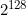
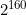
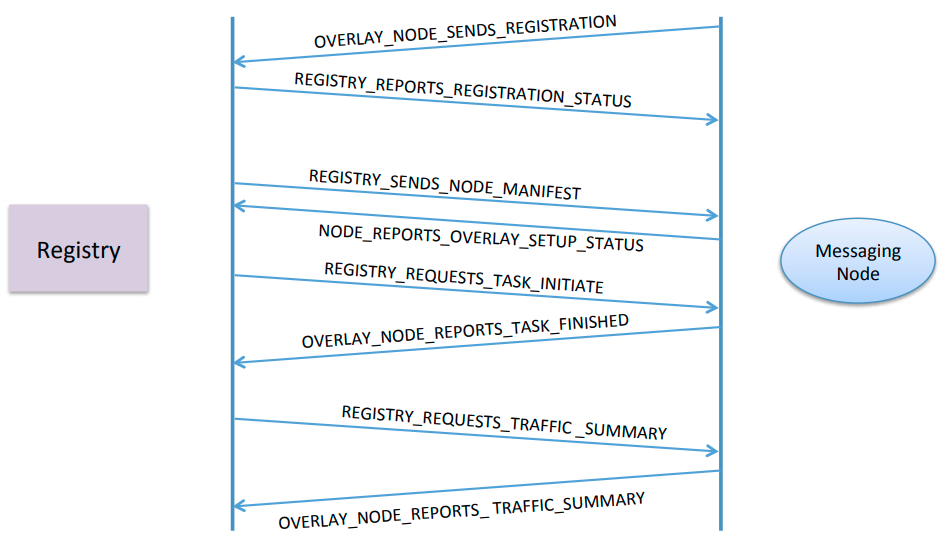
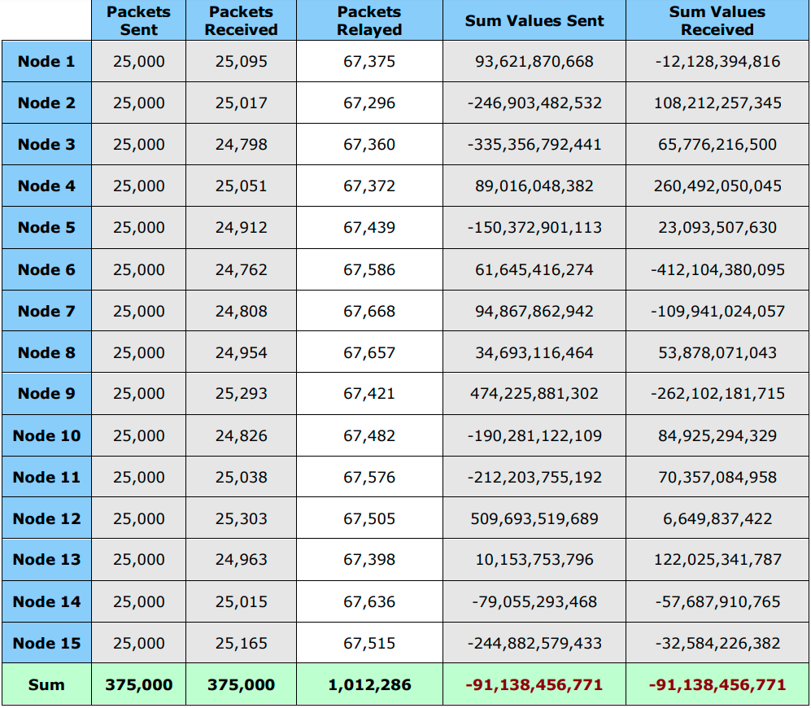

# Structured-P2P-Network-Overlay

The objective of this project is to get familiar with coding in a 
distributed setting where we need to manage the underlying 
communications between nodes. 
As part of this project we will be implementing routing schemes 
for packets in a structured peer-to-peer (P2P) overlay system. 

This project requires: 
   * Constructing a logical overlay over a distributed set of
    nodes.
   * Using partial information about nodes within the overlay to 
    route packets. 

The project demonstrates how partial information about nodes 
comprising a distributed system can be used to route packets
while ensuring correctness and convergence.

Nodes within the system are imposed a logical structure. 
This logical structure is the overlay. The overlay encompasses 
the organization of the nodes, their location, and how
information is maintained at each node. The logical overlay helps 
with locating nodes and routing content efficiently.

The overlay can contain any number of messaging nodes. Each 
messaging node is connected to some other messaging node.

Once the overlay has been setup, messaging nodes in the system 
will select a node at random and send a message to that node. 
Rather than send this message directly to the sink node, the 
source node will use the overlay for communications. Each node 
consults its routing table, and either routes the packet to its 
final destination or forwards it to an intermediate node closest 
(in the node ID space) to the final destination. 

Depending on the overlay, there may be zero or more intermediate 
messaging nodes between a particular source and sink that packets 
must pass through. Such intermediate nodes relay the message to 
the sink. Verification of correctness of packet exchanges between 
the source and sink are done by ensuring that the number of 
messages that you send and receive within the system match, and 
these messages have not been corrupted in transit to the intended 
recipient. Message exchanges happen continually in the system. 
All communication is based on TCP.

This project is a simplified version of a structured P2P system 
based on distributed hash tables (DHTs); the routing here is a 
simplified implementation of the well-known Chord P2P system.
In most DHTs node identifiers are 128-bits (when they are based 
on UUIDs) or 160-bits (when they are generated using SHA-1). In 
such systems the identifier space ranges from 0 to 
 or
.
Structured P2P systems are important because they have 
demonstrably superior scaling properties.

## Components
There are two components as part of this project: the registry and
messaging node. There is exactly one instance of the registry and 
multiple instances of the messaging nodes.

#### Registry
There is exactly one registry in the system. The registry provides 
the following functions:
* Allows messaging nodes to register themselves. This is performed 
when a messaging node starts for the first time.
* Assign random identifiers (between 0-127) to nodes within the 
system; the registry also has to ensure that no two nodes are 
assigned the same ID.
* Allows messaging nodes to deregister themselves. This is 
performed when a messaging node leaves the overlay.
* Enables the construction of the overlay by populating the 
routing table at the messaging nodes. The routing table 
dictates the connections that a messaging node initiates with 
other messaging nodes in the system.

The registry maintains information about the registered messaging 
nodes. The registry does not play any role in the routing of data 
within the overlay. Interactions between the messaging nodes and 
the registry are via request-response messages. For each request 
that it receives from the messaging nodes, the registry will send
a response back to the messaging node (based on the IP address 
associated with the socket’s input stream) where the request 
originated. The contents of this response depend on the type of 
the request and the outcome of processing this request.

#### Messaging Node
There are multiple messaging nodes in the system. A messaging 
node provides two closely related functions: it initiates and 
accepts both communications and control messages within the 
system.

Each messaging node automatically configures the port over 
which it listens for communications. Once the initialization is 
complete, the node should send a registration request to the 
registry. Each node in the system has a routing table that is 
used to route content to the sink. This routing table contains 
information about a subset of nodes in the system. Messaging 
nodes use this routing table to forward packets to the sink 
specified in the message. Every messaging node makes local 
decisions based on its routing table to get the packets closer 
to the sink.

## Interaction between components
In this project there are several control message types. Each
of these message types have their own separate class. These
classes are responsible for reading and creating marshalled
byte arrays to be sent to nodes.

#### Registration message type
Upon starting up, each messaging node registers its IP address
, and port number with the registry. There are four fields
in this registration request:
```
byte: Message Type (OVERLAY_NODE_SENDS_REGISTRATION)
byte: length of following "IP address" field
byte[^^]: IP address; from InetAddress.getAddress()
int: Port number
```

When the registry receives this request, it checks to see if the
node had previously registered and ensures that the IP address
in the message matches the address where the request originated
. The registry issues an error message under two circumstances:
* If the node had previously registered and has a valid entry in
 its registry.
* If there is a mismatch in the address that is specified in
 the registration request and the IP address of the request

If there is no error, the registry generates a unique
identifier (between 0-127) for the node while ensuring that there
are no duplicate IDs being assigned. The contents of the
response message generated by the registry are depicted below
. The success or failure of the registration request is
indicated in the status field of the response message.
```
byte: Message type (REGISTRY_REPORTS_REGISTRATION_STATUS)
int: Success status; Assigned ID if successful, -1 if failure
byte: Length of following "Information string" field
byte[^^]: Information string; ASCII charset
```

If the registration was successful, the registry includes a
message that indicates the number of entries currently present
in its registry. A sample information string is ***“Registration
request successful. The number of messaging nodes currently
constituting the overlay is (5)”***. If the registration was
unsuccessful, the message from the registry should indicate why
the request was unsuccessful. In the rare case that a messaging
node fails just after sending a registration request, the registry
will not be able to communicate with it. In this case, the
entry for the messaging node is removed from the data structure
maintained at the registry.

#### Deregistration message type
When a messaging node exits it it deregisters itself. This is
done by sending a deregistration message to the registry. This
deregistration request includes the following fields:
```
byte: Message Type (OVERLAY_NODE_SENDS_DEREGISTRATION)
byte: length of following "IP address" field
byte[^^]: IP address; from InetAddress.getAddress()
int: Port number
int: assigned Node ID
```

The registry checks if the request is valid by checking where
the message originated and if the node was previously
registered. Error messages are returned in case of a mismatch
in the addresses or if the messaging node is not registered
with the overlay. The registry will respond with a
`REGISTRY_REPORTS_DEREGISTRATION_STATUS` control message that is
similar to the `REGISTRY_REPORTS_REGISTRATION_STATUS` message.

#### Peer node manifest message type
Once the **setup-overlay** command is specified at the registry it
performs a series of actions that lead to the creation of the
overlay with a routing table being installed at every node.
Afterwards, messaging nodes initiate connections with each other
. Messaging nodes await instructions from the registry
regarding other messaging nodes to connect to – messaging
nodes only initiate connections to nodes that are part of its
routing table. 

The registry must ensure two properties. First, it must ensure
that the size of the routing table at every messaging node in
the overlay is identical; this is a configurable metric (with a
default value of 3) and is specified as part of the **setup
-overlay** command. 

If the routing table size requirement for the overlay is 

 , each messaging node will have links to 

other messaging nodes in the overlay. The registry selects these

messaging nodes that constitute the peer-messaging nodes list
for a messaging node such that the first entry is one hop away
in the ID space, the second entry is two hops away, and the
third entry is 4 hops away. Consider a network overlay
comprising nodes with the following identifiers: 10, 21, 32, 43
, 54, 61, 77, 87, 99, 101, 103. The routing table at 10
includes information about nodes <21, 32, and 54> while the
routing table at node 101 includes information about nodes <103
, 10, 32>; notice how the ID space wraps around after 103. A
messaging node initiates connections to all nodes that are part
of its routing table. A messaging node should never be connect
to itself. The registry also informs each node about the IDs
of all nodes in the system. This information is used in the
testing part of the overlay to randomly select sink nodes
that messages should be sent to. The registry includes all this
information in a `REGISTRY_SENDS_NODE_MANIFEST` message. The
contents of the manifest message are different for each
messaging node (since the routing table at every messaging node
is different). The wire format is shown when 

, if 

there will also be an entry for a node

hops away.
```
byte: Message type; REGISTRY_SENDS_NODE_MANIFEST
byte: routing table size N R
int: Node ID of node 1 hop away
byte: length of following "IP address" field
byte[^^]: IP address of node 1 hop away; from InetAddress.getAddress()
int: Port number of node 1 hop away
int: Node ID of node 2 hops away
byte: length of following "IP address" field
byte[^^]: IP address of node 2 hops away; from InetAddress.getAddress()
int: Port number of node 2 hops away
int: Node ID of node 4 hops away
byte: length of following "IP address" field
byte[^^]: IP address of node 4 hops away; from InetAddress.getAddress()
int: Port number of node 4 hops away
byte: Number of node IDs in the system
int[^^]: List of all node IDs in the system [Note no IPs are included]
```
Note that the manifest message includes IP addresses only for
nodes within a particular node’s routing table. Upon receipt of
the manifest from the registry, each messaging node initiates
connections to the nodes that comprise its routing table.

#### Node overlay setup message
Upon receipt of the `REGISTRY_SENDS_NODE_MANIFEST` from the
registry, each messaging node should initiate connections to
the nodes in its routing table. Every messaging node must
report to the registry on the status of setting up connections
to nodes that are part of its routing table. The message schema
is outlined below
```
byte: Message type (NODE_REPORTS_OVERLAY_SETUP_STATUS)
int: Success status; Assigned ID if successful, -1 in case of a failure
byte: Length of following "Information string" field
byte[^^]: Information string; ASCII charset
```

#### Initiate sending messages message
The registry informs nodes in the overlay when to start sending
messages to each other. It does so via the
`REGISTRY_REQUESTS_TASK_INITIATE` control message. This message
also includes the number of packets that must be sent by each
messaging node.
```
byte: Message type; REGISTRY_REQUESTS_TASK_INITIATE
int: Number of data packets to send
```

#### Send data packets message
Data packets can be fed into the overlay from any messaging
node within the system. Packets are sent from a source to a
sink; it is possible that there might be zero or more
intermediate nodes in the system that relay packets en route to
the sink. Every node tracks the number of messages that it has
relayed during communications within the overlay.

When a packet is ready to be sent from a source to the sink
, the source node consults its routing table to identify the
best node that it should send the packet to. There are two
situations: there is an entry for the sink in the routing table
, or the sink does not exist in the routing table and the
messaging node must relay the packet to the closest node to the
sink. Routing decisions only target nodes that are clockwise
successors. 

A key requirement for the dissemination of packets within the
overlay is that no messaging node should receive the same
packet more than once.
```
byte: Message type; OVERLAY_NODE_SENDS_DATA
int: Destination ID
int: Source ID
int: Payload
int: Dissemination trace field length (number of hops)
int[^^]: Dissemination trace comprising nodeIDs that the packet traversed
through
```

The dissemination trace includes nodes (except the source and
sink) that were involved in routing the particular packet.

#### Inform registry of task completion
Once a node has completed its task of sending a certain number
of messages, it informs the registry of its task completion
using the `OVERLAY_NODE_REPORTS_TASK_FINISHED` message.
This message should have the following format:
```
byte: Message type; OVERLAY_NODE_REPORTS_TASK_FINISHED
byte: length of following "IP address" field
byte[^^]: Node IP address:
int: Node Port number:
int: nodeID
```

#### Retrieve traffic summaries from nodes
Once the registry has received
`OVERLAY_NODE_REPORTS_TASK_FINISHED` messages from all the
registered nodes it will issue a
`REGISTRY_REQUESTS_TRAFFIC_SUMMARY message`. This message is sent
to all the registered nodes in the overlay. This message will
have the following format.
```
byte: Message Type; REGISTRY_REQUESTS_TRAFFIC_SUMMARY
```

#### Sending traffic summaries from the nodes to the registry
Upon receipt of the `REGISTRY_REQUESTS_TRAFFIC_SUMMARY` message
from the registry, the messaging node creates a response
that includes summaries of the traffic that it has participated
in. The summary includes information about messages that
were sent, received, and relayed by the node. This message will
have the following format.
```
byte: Message type; OVERLAY_NODE_REPORTS_TRAFFIC_SUMMARY
int: Assigned node ID
int: Total number of packets sent
(only the ones that were started/initiated by the node)
int: Total number of packets relayed
(received from a different node and forwarded)
long: Sum of packet data sent
(only the ones that were started by the node)
int: Total number of packets received
(packets with this node as final destination)
long: Sum of packet data received
(only packets that had this node as final destination)
```
Once the `OVERLAY_NODE_REPORTS_TRAFFIC_SUMMARY` message is sent
to the registry, the node must reset the counters associated
with traffic relating to the messages it has sent, relayed, and
received so far: the number of messages sent, summation of sent
messages, etcetera.

#### Summary of Messages Exchanged between the registry and node
The figure below depicts the exchange of messages between the registry and a particular messaging
node in the system.


#### Values for the control messages
The following values for control messages are used:
```
 OVERLAY_NODE_SENDS_REGISTRATION            2
 REGISTRY_REPORTS_REGISTRATION_STATUS       3
   
 OVERLAY_NODE_SENDS_DEREGISTRATION          4
 REGISTRY_REPORTS_DEREGISTRATION_STATUS     5
 
 REGISTRY_SENDS_NODE_MANIFEST               6
 NODE_REPORTS_OVERLAY_SETUP_STATUS          7
 
 REGISTRY_REQUESTS_TASK_INITIATE            8
 OVERLAY_NODE_SENDS_DATA                    9
 OVERLAY_NODE_REPORTS_TASK_FINISHED         10
 
 REGISTRY_REQUESTS_TRAFFIC_SUMMARY          11
 OVERLAY_NODE_REPORTS_TRAFFIC_SUMMARY       12 
```

## Supported Commands
#### Commands supported by the registry
#####list-messaging-nodes
This result in information about the messaging nodes (hostname
, port-number, and node ID) being listed. Information for each
 messaging node should be listed on a separate line.

#####setup-overlay <number-of-routing-table-entries>
This results in the registry setting up the overlay. It
does so by sending every messaging node the
`REGISTRY_SENDS_NODE_MANIFEST` message that contains
information about the routing table specific to that node and
also information about other nodes in the system. This does not
deal with the case where a messaging node is added or removed
after the overlay has been set up.

#####list-routing-tables
This lists information about the computed routing tables
for each node in the overlay. Each messaging node’s information
includes the node’s IP address, portnum, and logical-ID.

#####start number-of-messages (e.g. start 25000)
The start command results in the registry sending the 
`REGISTRY_REQUESTS_TASK_INITIATE` to all nodes within the
overlay. A command of start 25000 results in each messaging
node sending 25000 packets to nodes chosen at random. A detailed
description of the sequence of actions that this triggers 
is provided in [citation needed].

##### set-wait-time
This sets the wait time before collecting traffic summary. The
default value is 50 seconds.
 
##### enable-logger: 
This enables the logging information to be printed on the registry

#### Commands supported by the messaging nodes
##### print-counters-and-diagnostics
This prints information (to the console using System.out) about
the number of messages that have been sent, received, and
relayed along with the sums for the messages that have been
sent from and received at the node.

##### exit-overlay
This allows a messaging node to exit the overlay. The messaging
node first sends a deregistration message to the registry and
await a response before exiting and terminating the process.

##### print-routing-table
This prints the routing table at the current messaging node

##### register
This registers the node with the registry. By default the node
automatically registers when first started.

##### enable-logger
This enables the logging information to be printed

##### disable-logger
This disables the logging information from being printed on screen

## Setting
For the remainder of the discussion we assume that the **setup
-overlay** command has been specified. Also, nodes will not be
added to the system from hereon. Any errors during the overlay
setup is reported back to the registry.

The start command can only be issued after all nodes in the
overlay report success in establishing connections to nodes
that comprise its routing table. This is reported in the
`NODE_REPORTS_OVERLAY_SETUP_STATUS` message. Only after all
nodes report success in setting up connections the
registry prints out information on the console saying
: **“Registry now ready to initiate tasks.”**

When the **start** command is specified at the registry, the
registry sends the `REGISTRY_REQUESTS_TASK_INITIATE` control
message to all the registered nodes within the overlay. Upon
receiving this information from the registry, a given node will
start exchanging messages with other nodes.

Each node participates in a set of rounds. Each round involves
a node sending a packet to a randomly chosen node (excluding
itself) from the set of all registered nodes advertised in the
`REGISTRY_SENDS_NODE_MANIFEST`. All communications in the
system will be based on TCP. To send a data packet the source
node consults its routing table to make decisions about the
link to send the packet over. During a packet’s routing from
the source to the sink there might be zero or more intermediate
nodes relaying the packet en route to the destination sink node
. The payload of each data packet is a random integer with
values that range from 2147483647 to -2147483648. During each
round, 1 packet is sent. At the end of each round, the process
is repeats by choosing another node at random. The number of
rounds that each node will participate in is specified in the
`REGISTRY_REQUESTS_TASK_INITIATE` command. 

####Tracking communications between nodes
Each node maintains two integer variables that are initialized
to zero: sendTracker and receiveTracker. The sendTracker
represents the number of data packets that were sent by that
node and the receiveTracker maintains information about the
number of packets that were received. Additionally, each node
tracks the number of packets that it relayed – i.e., packets
for which it was neither the source nor the sink. 

Consider the case where there are 10 nodes in the system and
every node sends 25,000 packets. With 10 nodes in the system
, the total number of data packets would be 250,000. Since a
sending node chooses the target node at random, the number of
packets received by different receivers is different.

The number of packets that a node relays depends on the overlay
topology and the routing table supplied at each messaging node
. The number of packets is tracked using the variable
relayTracker. To track the data packets that it has sent and
received, each node maintains two additional long variables
that are initialized to zero: sendSummation and
receiveSummation. The data type for these variables is a long
to cope with overflow issues that will arise as part of the
summing operations that will be performed. The variable
sendSummation, continuously sums the values of the random numbers
that are sent, while the receiveSummation sums values of the
payloads that are received. The values of sendSummation and
receiveSummation at a node can be positive or negative.

The following figure shows depiction of a possible overlay and
the routing table at each node.


The following figure shows how packets are routed (from 97 to 82).


#### Correctness Verification
Verification of correctness is done by checking the number of
messages that were sent and received, and if these packets were
corrupted.

The total number of messages that were sent and received by the
set of all nodes must match i.e. the cumulative sum of the
receiveTracker at each node must match the cumulative sum of the
sendTracker variable at each node. We check that these packets
were not corrupted by verifying that: when we add up the values
of sendSummation it will exactly match the added up values of
receiveSummation.

#### Collecting and printing outputs
When a messaging node completes sending the required number of
packets, it sends a `OVERLAY_NODE_REPORTS_TASK_FINISHED` message
to the registry. When the registry receives an
`OVERLAY_NODE_REPORTS_TASK_FINISHED` message from each of the N
registered nodes in the system, it issues a
`REGISTRY_REQUESTS_TRAFFIC_SUMMARY` message to all the nodes
. Upon receipt of the `REGISTRY_REQUESTS_TRAFFIC_SUMMARY
` message, a prepares to send information about the data
packets that it has sent and received. This includes: the
number of packets that were sent by that node, the summation of
the sent packets, the number of packets that were received by
that node, and the summation of the received packets. The node
packages this information in the
`OVERLAY_NODE_REPORTS_TRAFFIC_SUMMARY` message and sends it to
the registry. After a node generates the
`OVERLAY_NODE_REPORTS_TRAFFIC_SUMMARY`, it resets the counters
that it maintains. This will allow testing the software for
multiple runs.

Example output at the registry: Upon receipt of the 
`OVERLAY_NODE_REPORTS_TRAFFIC_SUMMARY` from all the registered
nodes, the registry proceeds to print out the table as
depicted below with each row on a separate line. The collated
outputs from 15 nodes are depicted below. Note that the number of
received messages may be slightly different than the number of
sent messages at each node. The summation of sent or received
messages at a node may be negative. In this particular example
the final summation across all nodes is negative, it may well
be positive.


## Command line arguments for the two components
Classes are organized in a package called cs455.overlay. The
command-line arguments and the order in which they are
specified for the Messaging node and the Registry are listed below
```
java cs455.overlay.node.Registry portnum
java cs455.overlay.node.MessagingNode registry-host registry-port
```

## Overview of classes
#### Event
This is an interface containing the `getType()`, `getBytes()`, and
`print()` method to be implemented by any class that implements
Event. The `getType()` method returns the message type of the
wireformat. This message type is an integer and is defined in
the Protocol.java interface. The implementation of the `print()` 
method should only print the values of the member variables in
a class implementing the Event interface.

#### Protocol	
Interface containing wireformat types and their associated
integer values. These integer values are the types of the
control messages that are sent to and from the registry and in
between the messaging nodes

####EventFactory
Singleton class containing the `createEvent()` public method
, that returns a new wireformat class instance depending on the
type of the marshalled byte passed to this method as argument.

#### NodeReportsOverlaySetupStatus	
Class implementing the Event and Protocol interface. Acts as a
wrapper for the marshalled bytes received by the receiver
thread.  This class contains two constructors, one is the empty
constructor and the other constructor takes in the marshalled
bytes received by the receiver thread and extracts the success
status and information string. The `getBytes()` method returns a
marshalled byte array of the same message type as the constructor.

#### OverlayNodeReportsTaskFinished
This is the same as the `NodeReportsOverlaySetupStatus` class
, but it extracts the ip address, port and node ID when a
marshalled byte array of `OverlayNodeReportsTaskFinished` type
of message is passed as arguments to the constructor.

#### OverlayNodeReportsTrafficSummary
Acts as a wrapper for `OverlayNodeReportsTrafficSummary
` message that is passed from the messaging nodes to the
registry on task completion of routing the specified number of
messages. When a marshalled byte array of this message type is
passed in as argument to the constructor, it extracts the
nodeID, number of packets sent, number of relayed messages
, summation of the payload of each packet sent, summation of
 the payload of each packet received, and the number of packets
relayed by the messaging across the network. The `getBytes()` 
function in this class returns these same attributes in a new
marshalled byte array.

#### OverlayNodeSendsData
Acts as a wrapper for `OverlayNodeSendsData` message sent
between the messaging nodes in the overlay. When a marshalled
byte array of this message type is passed in as argument to the
constructor, it extracts the destination ID, source ID, payload
and packet trace of the message. The 
`insertInPacketTrace(nodeID)` function inserts a node ID in the
packet trace of the message. The `getBytes()` function returns
a marshalled byte array containing these same attributes.

#### OverlayNodeSendsDeregistration
Wrapper for `OverlayNodeSendsDeregistration` message. The
constructor for this class when passed a marshalled byte array
extracts the ip address, port, and node id of the message. The
`getBytes()` function behaves similar to the implementations of
`getBytes()` function in other wireformat marshalled byte
wrapper classes such as `OverlayNodeReportsTrafficSummary`, 
`NodeReportsOverlaySetupStatus`, etc.

#### OverlayNodeSendsRegistration
Wrapper for `OverlayNodeSendsRegistration` message sent to the
registry when a messaging node wants to register. When a
marshalled byte array is passed to the constructor of this
object it extracts the ip address and port and stores them in
private variables. The `getBytes()` function constructs and
returns a new marshalled byte array of of the same type as the
argument in the constructor with the information stored in the
private variables.

#### RegistryReportsDeregistration
Wrapper for `RegistryReportsDeregistration` message sent to the
messaging node after receipt of the
`OverlayNodeSendsDeregistration` message from the messaging
node that wants to deregister. Constructor for this class
takes in an argument which is the marshalled byte array of this
message type and extracts the success status and the
information string. This class also has an empty constructor
for constructing an empty marshalled byte of this
message type by calling `getBytes()` method after populating
the success status and information string in an object of this
class.

#### RegistryReportsRegistrationStatus
Wrapper for the `RegistryReportsRegistrationStatus` message
sent to the messaging nodes after an overlay node sends a
registration request. The constructor for this class takes in
as input the marshalled byte array representation of the
message and extracts the success status and information string
. This class also contains an empty constructor which can be
used to construct a message of this type by manually filling
out the public success status and information string member
variables and calling the `getBytes()` method to get a byte
array representation of the current state of the class as a
marshalled byte array of type `RegistryReportsRegistrationStatus`.

#### RegistryRequestsTaskInitiate
Wrapper for the `RegistryRequestsTaskInitiate` message sent to
the messaging node(s) after the issue of the command 
`start <number-of-messages>`. The constructor for this class
takes in as input the marshalled byte array representation of
this type and extracts the number of packets. This extracted
value is stored in the class member variable num_packets. This
class also contains an empty constructor used primarily to
construct a message of this type by manually setting the
num_packets member variable and calling the `getBytes()` method
to return the marshalled byte array.

#### RegistryRequestsTrafficSummary
Wrapper for the `RegistryRequestsTrafficSummary` message. This
message is sent to the messaging node(s) after they are done
with sending out their specified number of messages. Once the
messaging nodes receives this message they send their traffic
summaries to the registry wrapping it in
`OverlayNodeReportsTrafficSummary` message. The
`RegistryRequestsTrafficSummary` message is only a control
signal to tell the messaging nodes to start sending their
traffic summaries to the registry.

#### RegistrySendsNodeManifest
Wrapper class for the `RegistrySendsNodeManifest` message sent
to the messaging nodes after issue of the command 
`setup-overlay <routing-table-size>`. The constructor for this
class takes in as input the marshalled byte array of the
`REGISTRY_SENDS_NODE_MANIFEST` message type and extracts the
routing table and the IDs of all the nodes in the system. This
class also contains an empty constructor for creating a message
of `REGISTRY_SENDS_NODE_MANIFEST` type by manually populating
the routing table and the IDs of all the nodes in the system
and calling the `getBytes()` method to get a marshalled byte
array representation.

#### Util
This class contains a set of utility functions for use
throughout the project. These functions include `randInt()`,
`randChoice()`, `generateRandomIP()`, `readString()`, 
`readType()`, `getNextNode()`, `getRemoteAddressPortPair()`. 
The `randInt()` function takes in as input the min and max
arguments for the range of the generated random number and
returns a random number within that range. If the `min` and `max`
are not specified, the range of the output is from `Int.MIN_INT`,
`Int.MAX_INT`. The `randChoice()` function takes in as argument
an integer arraylist and returns a random element from that
array. The `generateRandomIP()` function takes in no argument
and returns a random IP string. The `readString()` function
takes in as argument a `DataInputStream` and returns a string
by first reading the length of the string in bytes by doing a
`readByte()` on the data input stream and then reading the
string into a byte array using `readFully()` in the data input
stream and creating and returning a new string object. This
function is meant to act as a wrapper for reading string
entries from data input streams. The `readType()` function
takes in as argument a data input stream, reads the first byte
and returns an integer cast of it. The `readType()` function
acts as a wrapper for reading the type of the marshalled byte
array. The function `getNextNode()` takes in as arguments the
routing table of a messaging node and the destination node ID
and returns the ID of the next node to route the message to if the
message was not meant for the current node. The
`getRemoteAddressPortPair()` function takes in as argument a
socket and returns the string concatenation of the sockets
remote IP address and port separated by a colon.

#### StatisticsCollectorAndDisplay
This class is used to store the traffic summary for each
messaging node when they are receiving, relaying and sending
messaging. This class basically acts as a statistics counter
for the components comprising the traffic summary message which
is sent to the registry upon request.

#### SortedArrayList
This class inherits the ArrayList class in java and adds a new
method to insert elements into the array list in a sorted
order. This is done to make sure that the node IDs when they
are put in this SortedArrayList it always sorted in ascending
order.

#### LOGGER
This is the logger used throughout the assignment for debugging
.

#### TCPServerThread
This class implements the Runnable interface. This class starts
the server on the registry and the messaging nodes in a
separate thread listening for connections. When a client
connects, this class returns an instance of the `TCPConnection`
object to be handled by the class that created this 
`TCPServerThread` instance on a separate thread.

#### TCPSenderQueue
The purpose of this class is to queue all of the TCP packets to
be sent one at a time to prevent the TCP buffer from being
overwhelmed and blocking indefinitely

#### TCPSender
This class contains the code to send a message, which is a
marshalled byte array to the other end of the socket in its
private member variable.

#### TCPReceiverThread
This class implements the Runnable interface and handles the
receiving and processing of packets from a socket. The packets
are marshalled byte arrays.

#### TCPConnectionsCache
This class stores every `TCPConnection` instance returned by the
`TCPServer` thread for purpose of reusing connections when
sending messages to and from nodes and the between the registry
and the messaging nodes.

#### TCPConnection
This class encapsulates the `TCPSender` and `TCPReceiver` and
starts the `TCPReceiver` on a separate thread when
`startTCPReceiver()` function is called. This class also starts
the `TCPSedner` when `startTCPSender()` is called. This class
also contains functions to get the remote and local port of the
socket that is returned by the `TCPServer`.

#### RoutingEntry
This class contains the routing entries that comprise the
routing table. Each entry contains the distance, node ID, IP
and port of a single messaging node in the routing table.

#### RoutingTable
This class consists of multiple routing entries and is sent to
the messaging nodes by the registry when the `setup-overlay`
command is issued. The messaging nodes establish connections to
other messaging nodes that are in its routing table.

#### RegistryNode
This is the class that contains the code for the registry node.

#### Registry
This is the main class that starts the registry node on a given
port number pass as command line argument.

#### Peer
This class contains the code for all the functionality of the
messaging nodes.

#### Node
This is an interface implemented by the RegistryNode and the Peer.

#### MessagingNode
This class contains the main method used to start the messaging
nodes. The command line arguments passed are the registry host
and the registry port.